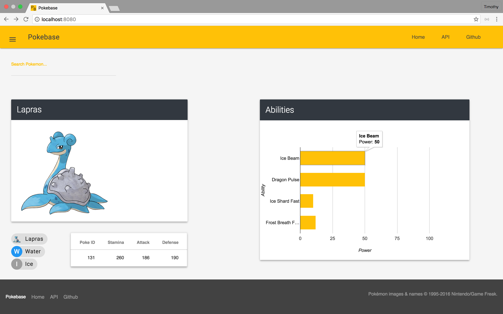

# Pokebase React

### Search for your favorite pokemon and look up their stats



##### Boot up the API server
```
$ cd pokebase-react
$ cd api-server
$ bundle install
$ rails db:create
$ rails db:migrate
$ rails db:seed
```

##### Boot up the client server
```
$ ..
$ npm install
$ npm start
$ open http://localhost:8080/
```

##### I used:
- rails 5 (api-server)
- react
- redux
- axios
- react-google-charts
- material design lite
